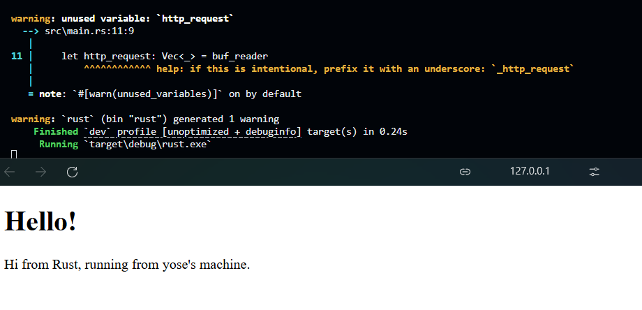
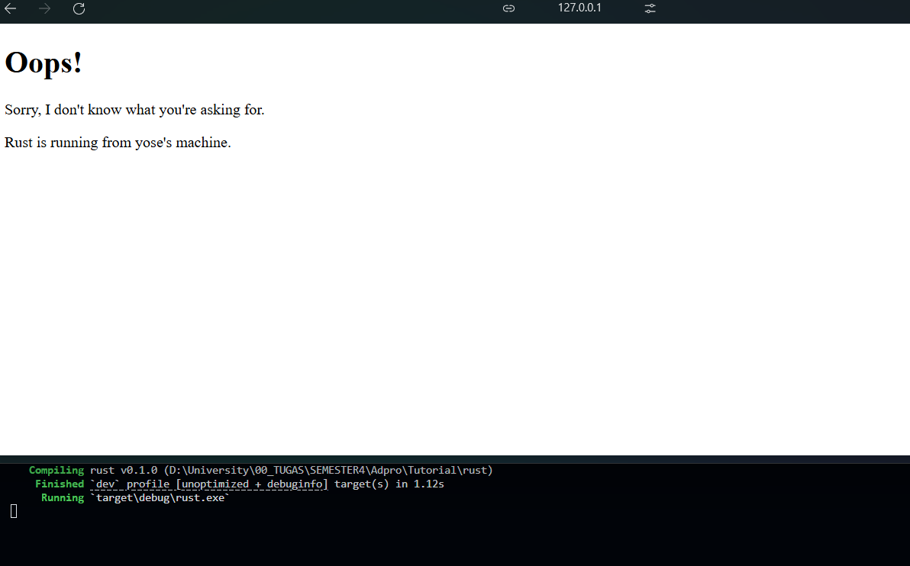

# hello-advpro25

### Commit 1 notes 


```rust
fn handle_connection(mut stream: TcpStream) {
    let buf_reader = BufReader::new(&mut stream);
    let http_request: Vec<_> = buf_reader
        .lines()
        .map(|result| result.unwrap())
        .take_while(|line| !line.is_empty())
        .collect();
    println!("Request: {:#?}", http_request);
}
```

`BufReader::new(&mut stream)` wraps the stream in a BufReader to efficiently read from it. We then use several methods to process the BufReader. 
- `.lines()` returns an iterator over the lines of the stream.
- `.map(|result| result.unwrap())` unwraps each line, panicking if an error occours.
- `.take_while(|line| !line.is_empty())` takes lines until an empty line is encountered indicating the end of the HTTP request headers.
- `.collect()` collects the line to a `vec`. 

then `println!("Request: {:#?}", http_request)` prints the collected HTTP request lines to the console.

this code reads HTTP request headers from each connection and prints them to the console.

### Commit 2 notes 
```rust
fn handle_connection(mut stream: TcpStream) {
    let buf_reader = BufReader::new(&mut stream);
    let http_request: Vec<_> = buf_reader
        .lines()
        .map(|result| result.unwrap())
        .take_while(|line| !line.is_empty())
        .collect();
    let status_line = "HTTP/1.1 200 OK";
    let contents = fs::read_to_string("hello.html").unwrap();
    let length = contents.len();
    let response = format!("{status_line}\r\nContent-Length:
   {length}\r\n\r\n{contents}");
    stream.write_all(response.as_bytes()).unwrap();
}
```

After the code reads HTTP request headers, the code sends a response to the client containing the response header `status_line` then `Content-Length`, after that the `contents` which reads the `hello.html` file. 



### Commit 3 Notes 

```rust
fn get_page_by_request(request: &String) -> (&str, String) {
    if request.starts_with("GET / ") {
        return ("HTTP/1.1 200 OK", fs::read_to_string("pages/hello.html").unwrap());
    }
    return ("HTTP/1.1 404 NOT FOUND", fs::read_to_string("pages/404.html").unwrap());
}
```

I created `get_page_by_request` function to get the correct response header and content page. 

```rust
let (status_line, contents) = get_page_by_request(&http_request[0]);
```

Now, I only have to modify `status_line` and `contents` according to the function's return.




### Commit  4 notes

```rust 
fn get_page_by_request(request_line: &String) -> (&str, &str) {
    return match &request_line[..] {
        "GET / HTTP/1.1" => ("HTTP/1.1 200 OK", "pages/hello.html"),
        "GET /sleep HTTP/1.1" => {
            thread::sleep(Duration::from_secs(10));
            ("HTTP/1.1 200 OK", "pages/hello.html")
        }
        _ => ("HTTP/1.1 404 NOT FOUND", "pages/404.html"),
    };
}
``` 

`/sleep` endpoint is added, but since the program are single threaded, we have to wait for `/sleep` call to end before others can call a different endpoint.